# Awesome SQL Performance Monitoring ⚡

<p align="center">
  
</p>

<p align="center">
  <a href="https://github.com/ishandutta2007/Awesome-Awesome-Awesome"></a>
  <a href="https://discord.gg/jc4xtF58Ve"></a>
  <a href="https://github.com/ishandutta2007/Awesome-SQL-Performance-Monitoring/stargazers"></a>
  <a href="https://github.com/ishandutta2007/Awesome-SQL-Performance-Monitoring/network/members"></a>
  <a href="https://github.com/ishandutta2007/Awesome-SQL-Performance-Monitoring/blob/main/LICENSE"></a>
  <a href="https://github.com/ishandutta2007"></a>
</p>

---

## 🧭 Overview & Ecosystem Architecture 📊

**Awesome SQL Performance Monitoring** is a curated index of enterprise **SaaS observability platforms** and production-grade **open-source database performance monitoring projects**. 

Designed for **Database Administrators (DBAs)**, **Site Reliability Engineers (SREs)**, and **backend developers**, this guide covers solutions for:
- ⏱️ **Wait-Event & Bottleneck Analysis**: Drill down into lock contention, I/O waits, and CPU stalls.
- 🔍 **Slow Query Analytics (QAN)**: Uncover query regressions, execution frequency, and normalized statement execution latency.
- 💡 **AI Index Advisors & Query Rewrites**: Automated query optimization, redundant index discovery, and execution plan diagnostics (`EXPLAIN / ANALYZE`).
- 📈 **Estate-Wide Visibility & Health Metrics**: Unified dashboards across PostgreSQL, MySQL, Microsoft SQL Server, Oracle, CockroachDB, and cloud databases (Amazon RDS, AWS Aurora, Azure SQL, Google Cloud SQL).

---

## 📑 Table of Contents 📌
- [Market Landscape & Dynamics](#-market-landscape--dynamics-)
- [SaaS & Hosted Database Monitoring Platforms](#-saashosted-database-monitoring-platforms-)
- [Open-Source Database Monitoring Projects](#-open-source-database-monitoring-projects-)
- [Architectural Patterns: Building an OSS Monitoring Stack](#-architectural-patterns-building-an-oss-monitoring-stack-)
- [How to Contribute](#-how-to-contribute-)
- [Star History](#-star-history)
- [Disclaimer](#-disclaimer-)

---

## 🌐 Market Landscape & Dynamics 📈

The global database performance monitoring and observability sector is estimated at **$6.8 billion in 2026** (growing at an ~11.4% CAGR), and represents a **moderately fragmented market** transitioning from legacy on-premises DBA tools to cloud-native APM consolidation, where category-defining full-stack platforms (Datadog, New Relic) coexist alongside specialized, high-retention database engines (SolarWinds, Redgate, Idera) and modern niche optimizers.

---

## ☁️ SaaS/Hosted Database Monitoring Platforms 🏢

*SaaS platforms ordered in descending order by parent company scale (market valuation / annual revenue).*

| Product | Company Scale (Valuation / Revenue) | Description | Starting Pricing | Free Tier / Free Trial Limits |
| :--- | :--- | :--- | :--- | :--- |
| **[Datadog Database Monitoring](https://www.datadoghq.com/product/database-monitoring/)** 📊 | **~$42.5 Billion** market cap (~$2.68B ARR) | Enterprise observability platform tracking normalized query metrics, explain plans, and wait analysis correlated with APM traces, hosts, and logs. | $70/database host/month (billed annually, includes 200 normalized queries) or $84/host on-demand | 14-day free trial with full platform access (Infrastructure Free tier covers up to 5 hosts with 1-day metric retention; DBM features require trial/paid tier). |
| **[New Relic Database Monitoring](https://newrelic.com/)** 🔮 | **~$6.5 Billion** valuation (~$1.0B ARR) | Full-stack telemetric observability with database query performance visibility directly linked to distributed traces and application transactions. | $0.40/GB for data ingested beyond free tier; Standard user seats start at $10/month (1st user) and $99/user/month | Free forever plan provides 100 GB/month data ingestion, 1 full-platform user, and unlimited basic users with full APM & DB query visibility. |
| **[Quest Foglight](https://www.quest.com/products/foglight/)** 🛡️ | **~$5.4 Billion** valuation (~$850M revenue) | Cross-platform enterprise database and infrastructure performance monitoring with deep diagnostics, workload analytics, and SQL PI (Performance Investigator). | $499/year (entry module) or ~$1,000/instance for standard database cartridges | 30-day free trial with full platform access and diagnostic cartridges across test database instances with trial support. |
| **[SolarWinds Database Performance Analyzer (DPA)](https://www.solarwinds.com/database-performance-analyzer)** ⏱️ | **~$2.1 Billion** market cap (~$780M revenue) | Wait-time based analysis across SQL Server, Oracle, PostgreSQL, and MySQL with machine learning anomaly detection and multi-dimensional tuning guidance. | $1,195/year subscription (or $1,699 perpetual license per monitored database instance) | 14-day free trial with full functionality and unrestricted query monitoring across supported databases; no credit card required. |
| **[EverSQL](https://www.eversql.com/)** ⚡ | **~$3.0 Billion** parent valuation (Aiven) | Automated SQL query optimization, AI indexing recommendations, and schema/cost insights for PostgreSQL & MySQL (now part of Aiven). | Free tier available; paid plans / integrated Aiven AI Database Optimizer start at $29/month | Free forever tier includes web-based AI query optimizer & indexing recommendations (up to 5 query optimizations/month with basic performance sensor). |
| **[SQL Diagnostic Manager (Idera)](https://www.idera.com/)** 🩺 | **~$1.2 Billion** valuation (~$400M revenue) | Comprehensive SQL Server monitoring with real-time alerting, predictive alerting, workload analysis, index defragmentation, and diagnostic recommendations. | $1,247/monitored instance/year (Standard base subscription; Pro tier at $1,348/instance/year) | 14-day free trial with full unrestricted access to SQL Diagnostic Manager features across test SQL Server instances. |
| **[Redgate SQL Monitor](https://www.red-gate.com/products/sql-monitor/)** 🔍 | **~$150 Million** revenue | Estate-wide monitoring for SQL Server, Azure SQL, and cloud databases with plan-regression detection, blocking analysis, and DBA-tailored UX. | $1,233/server/year (Standard edition, 1–4 servers tier) | 14-day free trial offering unrestricted access to all monitoring, alerting, and diagnostics features across your test servers. |
| **[pganalyze](https://pganalyze.com/)** 🐘 | **~$10–20 Million** valuation (Bootstrapped/Private) | Deep PostgreSQL-focused monitoring with query analysis, Index Advisor, VACUUM Advisor, auto_explain integration, and log correlation. | $149/month (Production tier, covers 1 database server) | 14-day free trial with full feature access and unlimited query volume during evaluation; no permanent free tier. |
| **[DBmarlin](https://www.dbmarlin.com/)** 🐬 | **~$5–10 Million** valuation (Private UK) | Modern cross-platform database performance monitoring with wait-based analysis, explain plans, and historical comparison across mixed database fleets. | £999/year (~$1,270/year) per licence for Premium tier (unlimited instances scalable) | Free forever Starter tier includes 1 full database license forever, unlimited users, wait state analysis, explain plans, and AI co-pilot; no credit card required. |

---

## 🛠️ Open-Source Database Monitoring Projects 💻

*Open-source GitHub repositories ranked in descending order by GitHub Star count.*

1. **[netdata/netdata](https://github.com/netdata/netdata)** [](https://github.com/netdata/netdata/stargazers) ⚡  
   Real-time, ultra-low-latency infrastructure and database monitoring engine. Provides out-of-the-box auto-discovery and per-second metric resolution for PostgreSQL, MySQL, Redis, MongoDB, and Oracle with ML anomaly detection.

2. **[grafana/grafana](https://github.com/grafana/grafana)** [](https://github.com/grafana/grafana/stargazers) 📈  
   The de facto open-source visualization and dashboard platform for metrics, query traces, and log analytics with extensive pre-built community dashboards for PostgreSQL, MySQL, and SQL Server.

3. **[timescale/timescaledb](https://github.com/timescale/timescaledb)** [](https://github.com/timescale/timescaledb/stargazers) 🕒  
   Open-source time-series SQL engine engineered as a PostgreSQL extension, widely used as the ultra-fast long-term storage backend for database telemetry, metrics, and query execution logs.

4. **[sosedoff/pgweb](https://github.com/sosedoff/pgweb)** [](https://github.com/sosedoff/pgweb/stargazers) 🌐  
   Cross-platform, web-based PostgreSQL database browser and query analyzer written in Go, allowing quick visual inspection of query results, schemas, and live connection states.

5. **[ankane/pghero](https://github.com/ankane/pghero)** [](https://github.com/ankane/pghero/stargazers) 🦸  
   Clean, actionable PostgreSQL performance dashboard. Inspects slow running queries, missing and unused indexes, table/index space bloat, active connections, and query execution statistics.

6. **[sysown/proxysql](https://github.com/sysown/proxysql)** [](https://github.com/sysown/proxysql/stargazers) 🔀  
   High-performance, high-availability, protocol-aware proxy for MySQL and PostgreSQL. Collects in-depth query execution statistics, query digest timings, connection pool utilization, and query routing metrics.

7. **[zabbix/zabbix](https://github.com/zabbix/zabbix)** [](https://github.com/zabbix/zabbix/stargazers) 🏢  
   Mature, enterprise-grade open-source monitoring system with native templates and load agents for tracking SQL query execution times, transactions, lock counts, and buffer pool efficiencies across all major engines.

8. **[pgsty/pigsty](https://github.com/pgsty/pigsty)** [](https://github.com/pgsty/pigsty/stargazers) 🐷  
   Enterprise-grade battery-included PostgreSQL distribution and observability suite with top-tier Prometheus & Grafana monitoring dashboards covering query digests, wait events, and operating system counters.

9. **[darold/pgbadger](https://github.com/darold/pgbadger)** [](https://github.com/darold/pgbadger/stargazers) 🦡  
   High-speed Perl-based PostgreSQL log file analyzer that parses gigabytes of database log output to generate detailed HTML reports showing top slow queries, temporary file generation, checkpoints, locks, and errors.

10. **[prometheus-community/postgres_exporter](https://github.com/prometheus-community/postgres_exporter)** [](https://github.com/prometheus-community/postgres_exporter/stargazers) 🔌  
    Official community Prometheus exporter for PostgreSQL server metrics, supporting custom query metric collection, replication lag tracking, database connection metrics, and `pg_stat_*` scraping.

11. **[dalibo/pg_activity](https://github.com/dalibo/pg_activity)** [](https://github.com/dalibo/pg_activity/stargazers) 🖥️  
    Terminal-based command-line tool modeled after `top` and `htop` for live PostgreSQL server activity monitoring, showing active queries, blocking locks, I/O wait states, and worker process states.

12. **[prometheus/mysqld_exporter](https://github.com/prometheus/mysqld_exporter)** [](https://github.com/prometheus/mysqld_exporter/stargazers) 🐬  
    Standard Prometheus exporter for MySQL and MariaDB servers. Scrapes InnoDB buffer pool metrics, query throughput counters, handler statistics, thread states, and replication status.

13. **[cybertec-postgresql/pgwatch2](https://github.com/cybertec-postgresql/pgwatch2)** [](https://github.com/cybertec-postgresql/pgwatch2/stargazers) 🔬  
    Flexible, self-contained PostgreSQL metrics collector and monitoring dashboard developed by CYBERTEC, supporting push and pull models, Grafana dashboards, and TimescaleDB storage.

14. **[lesovsky/pgcenter](https://github.com/lesovsky/pgcenter)** [](https://github.com/lesovsky/pgcenter/stargazers) 🎛️  
    Multi-window command-line administration tool for PostgreSQL, featuring real-time views into `pg_stat_activity`, wait events, replication statistics, database vacuum progress, and table/index performance.

15. **[percona/pmm](https://github.com/percona/pmm)** [](https://github.com/percona/pmm/stargazers) 🏆  
    Percona Monitoring and Management: comprehensive open-source database observability platform featuring Query Analytics (QAN), automated advisors, and turnkey dashboards for MySQL, PostgreSQL, and MongoDB fleets.

16. **[free/sql_exporter](https://github.com/free/sql_exporter)** [](https://github.com/free/sql_exporter/stargazers) 📊  
    Database-agnostic SQL metric exporter for Prometheus. Run arbitrary SQL queries against any database (PostgreSQL, MySQL, SQL Server, ClickHouse, Snowflake) and automatically expose results as Prometheus metrics.

17. **[percona/pg_stat_monitor](https://github.com/percona/pg_stat_monitor)** [](https://github.com/percona/pg_stat_monitor/stargazers) ⏱️  
    Next-generation query performance statistics collector for PostgreSQL. Extends `pg_stat_statements` with time-bucketed aggregation, client IP tracking, query plan integration, and histogram latency percentiles.

18. **[trimble-oss/dba-dash](https://github.com/trimble-oss/dba-dash)** [](https://github.com/trimble-oss/dba-dash/stargazers) 🪟  
    Feature-rich open-source SQL Server monitoring tool designed by DBAs. Tracks wait stats, slow query captures, disk space growth, CPU usage, backup status, and OS performance counters across entire SQL Server estates.

19. **[lesovsky/pgscv](https://github.com/lesovsky/pgscv)** [](https://github.com/lesovsky/pgscv/stargazers) 📡  
    Lightweight, multi-purpose monitoring agent and Prometheus exporter for PostgreSQL ecosystems and Linux system metrics, including PgBouncer pooler stats.

---

## 🏗️ Architectural Patterns: Building an OSS Monitoring Stack 🧩

For engineering teams seeking self-hosted architectures without vendor lock-in or high SaaS ingest fees:

```
┌─────────────────────────────────┐
│   Database Engines              │
│   (PostgreSQL, MySQL, MSSQL)    │
└────────────────┬────────────────┘
                 │
                 ▼
┌────────────────────────────────────────────────────────┐
│  Metrics Collectors & Exporters                        │
│  - pg_stat_statements / pg_stat_monitor                │
│  - postgres_exporter / mysqld_exporter / sql_exporter  │
│  - PMM Client / pgSCV / pgcenter                       │
└────────────────┬───────────────────────────────────────┘
                 │
                 ▼
┌────────────────────────────────────────────────────────┐
│  Time-Series Storage & Ingestion                       │
│  - Prometheus / TimescaleDB / VictoriaMetrics          │
└────────────────┬───────────────────────────────────────┘
                 │
                 ▼
┌────────────────────────────────────────────────────────┐
│  Visualization & Alerting                              │
│  - Grafana DBA Dashboards + Alertmanager               │
│  - Deep Forensics: pgBadger (Log Analysis)             │
└────────────────────────────────────────────────────────┘
```

1. **Step 1: Metric Scraping**: Enable core stat engines (`pg_stat_statements` or `sys.dm_exec_query_stats`). Scrape metrics via **postgres_exporter** or **mysqld_exporter**.
2. **Step 2: Metric Storage**: Route telemetry into **Prometheus** or a **TimescaleDB** time-series cluster.
3. **Step 3: Unified Dashboards**: Visualize wait events, queries, and connection pools in **Grafana** using community DBA boards.
4. **Step 4: Forensics**: Supplement continuous metric tracking with batch log analysis using **pgBadger** for comprehensive execution plan forensics.

---

## 🤝 How to Contribute 📝
1. Fork this repository. 🍴
2. Add or update entries in `README.md` keeping descriptions factual, concise, and linked to official repositories or sites.
3. Ensure open-source projects include official GitHub links and SaaS listings follow the pricing and limits table format.
4. Submit a Pull Request with a short summary of the additions. 🚀

---

## 🌟 Star History

[](https://star-history.dera.page/#ishandutta2007/Awesome-SQL-Performance-Monitoring&type=date&legend=top-left)

---

## ⚖️ Disclaimer ⚠️
- This is a community-curated list and does not constitute formal endorsement or consulting advice.
- Database monitoring agents and instrumentation queries consume host CPU, memory, and connection slots. Always test sampling intervals and security retention policies in staging environments before deploying to production database clusters.
- All product and company names are trademarks™ or registered® trademarks of their respective holders.

---
<p align="center">
  <b>Curated for DBAs, SREs, and Platform Engineers building resilient, high-speed database infrastructures.</b><br>
  <sub>Keep query performance visible, reproducible, and under control.</sub>
</p>
